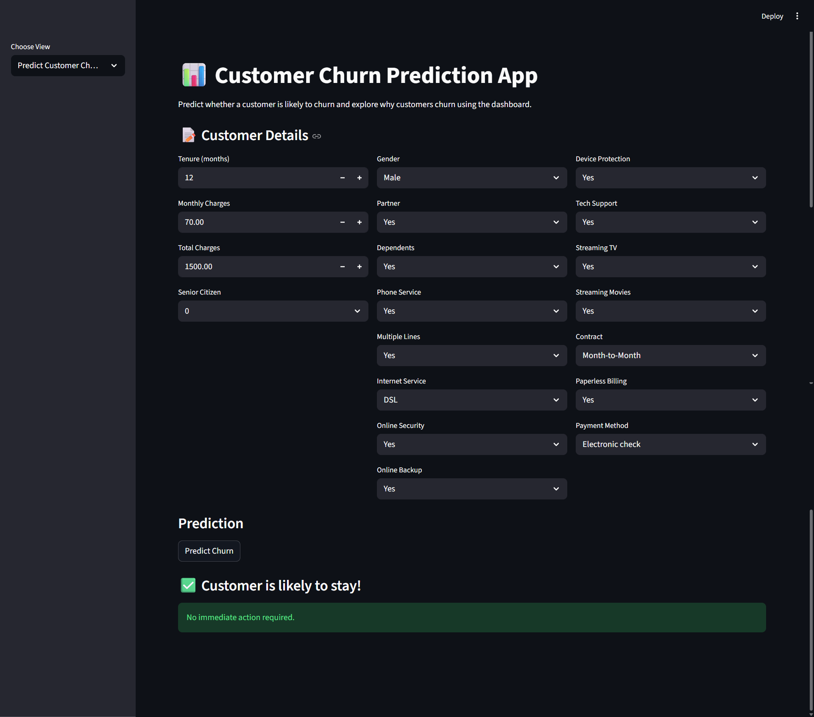
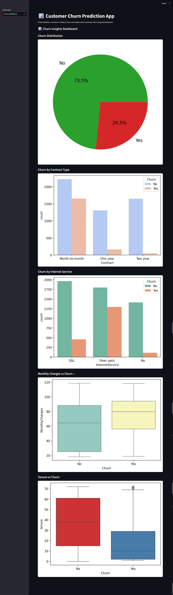
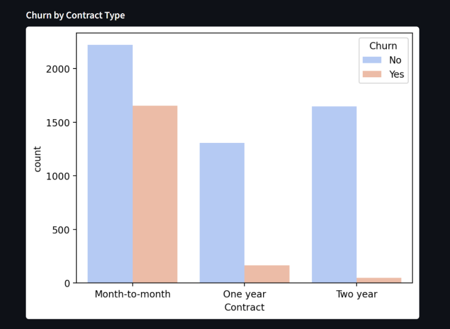
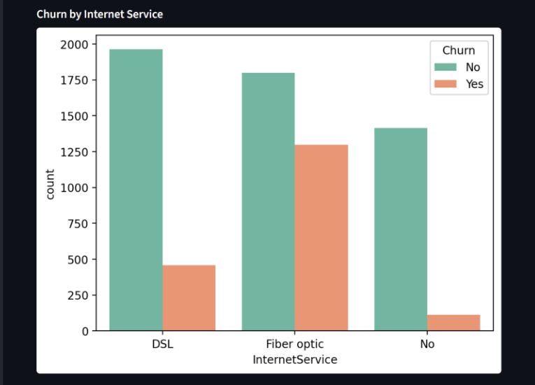
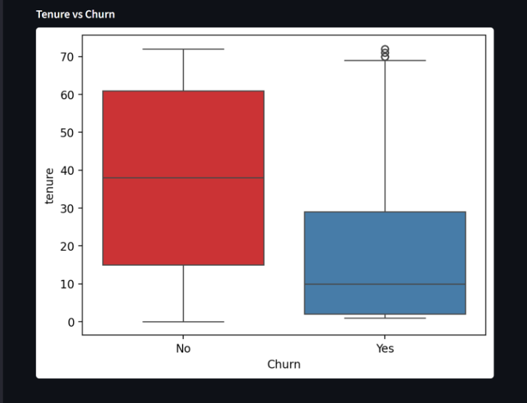

# 📊 Customer Churn Prediction App

This project predicts whether a customer is likely to **churn** (leave the service) or **stay**, based on their account information. It also provides a **Churn Insights Dashboard** to visualize patterns and understand why customers churn. Built with **Python**, **Streamlit**, and a trained **Random Forest model**, this project demonstrates both **machine learning** and **interactive dashboard creation**.

## Project Goals

- Predict customer churn based on account details
- Understand which factors contribute to customer churn
- Build an interactive dashboard for data visualization
- Showcase practical machine learning and data visualization skills
- Deploy a web app accessible to anyone via Streamlit

## Tools & Technologies

- Python  
- Pandas & NumPy  
- scikit-learn (Random Forest Classifier)  
- Matplotlib & Seaborn  
- Streamlit  

## Project Structure

customer-churn-prediction/
│
├── app.py # Streamlit app with prediction & dashboard
├── churn_model.pkl # Trained ML model
├── Telco-Customer-Churn.csv # Dataset for dashboard
├── requirements.txt # Python libraries
├── README.md # Project documentation
└── screenshots/ # Screenshots of Prediction & Dashboard

##  Features

1. **Customer Churn Prediction:**  
   Users can enter customer details such as tenure, monthly charges, contract type, internet service, and more to predict if a customer is likely to churn.  

2. **Churn Insights Dashboard:**  
   Visualizes key factors affecting churn, including:  
   - Churn distribution (pie chart)  
   - Churn by contract type  
   - Churn by internet service  
   - Monthly charges vs churn (boxplot)  
   - Tenure vs churn (boxplot)  

## Screenshots

### Prediction Page


### Dashboard Page


### Churn by Contract Type


### Churn by Internet Service


### Monthly Charges vs Churn


### Tenure vs Churn


## How to Run the App

### 1. Clone the repository
```bash
git clone https://github.com/niharikast/customer-churn-prediction.git
cd customer-churn-prediction
```

### 2. Install dependencies
bash
Copy code
pip install -r requirements.txt

### 3. Run Streamlit
bash
Copy code
streamlit run app.py

### 4. Explore the app
- Use the sidebar to switch between Predict Customer Churn and  Churn Dashboard
- Enter customer details for prediction
- Explore visualizations to understand why customers churn

## Deployment

This app can be deployed online for free using [Streamlit Cloud](https://share.streamlit.io/):

- Connect GitHub repository
- Set the main file as app.py
- Deploy → the app will be live online for anyone to use

## Learnings

- Preprocessing and encoding categorical features for ML models
- Training and using a Random Forest classifier for predictions
- Building interactive dashboards with Streamlit
- Data storytelling: visualizing why customers churn
- Deploying a Python app online for portfolio showcase

## Key Insights from Dashboard

- Customers on Month-to-Month contracts churn more frequently
- Customers with shorter tenure are more likely to leave
- High monthly charges can correlate with churn for some internet types
- Fiber optic users show slightly higher churn than DSL users
